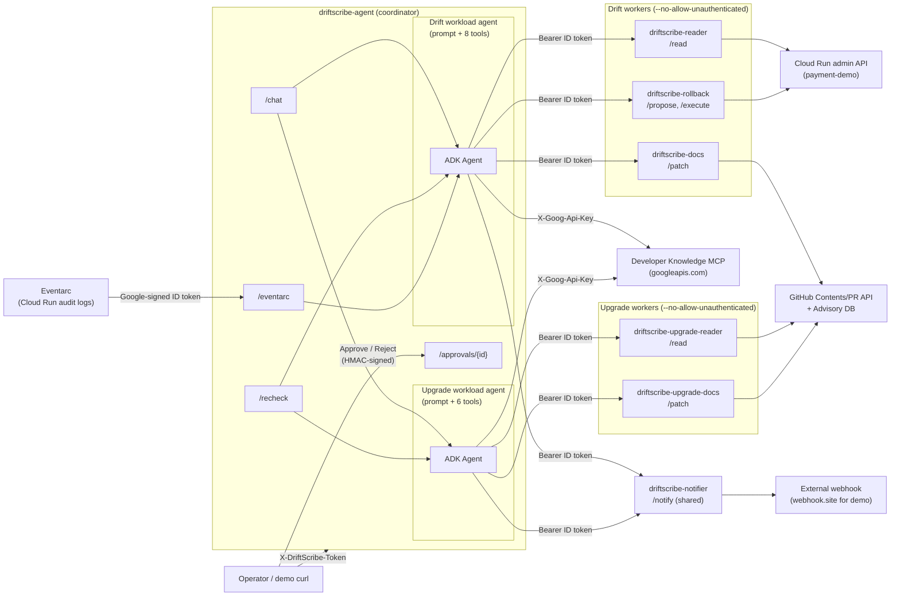

# DriftScribe multi-agent architecture

> **Status:** Phase 17 in progress — multi-agent framework + Developer Knowledge MCP. Two workloads ship: **drift** (Cloud Run env vs ops contract) and **upgrade** (npm `package.json` vs GitHub Advisory DB). The coordinator routes per `workload=<name>` and only ever shows the LLM that workload's tool subset. The MCP attaches at the coordinator only. See `docs/plans/2026-05-19-driftscribe-phase17-framework-mcp.md` for the per-task list.

---

## 1. System topology

DriftScribe is a coordinator + per-workload worker fleet. Each service runs on its own Cloud Run service with its own dedicated service account. The coordinator is the only public-facing entrypoint; workers refuse direct human traffic. The coordinator additionally attaches Google's Developer Knowledge MCP as a reasoning-time tool.

### Service inventory

| Service | Public? | Workload | Owns | Notes |
| --- | --- | --- | --- | --- |
| `driftscribe-agent` (coordinator) | Yes — `--allow-unauthenticated` + `X-DriftScribe-Token` | both | ADK agent loop, intent classification, approval HTML/HMAC, Firestore session + approval state, Developer Knowledge MCP attach | Single entrypoint for humans, Eventarc, and demo scripts. 10 callables in `COORDINATOR_TOOLS`; the LLM only ever sees the per-workload subset (8 drift, 6 upgrade — overlap on 4 tools: `notify`, `search_recent_prs`, `search_developer_docs`, `retrieve_developer_doc`; 8 + 6 − 4 = 10). |
| `driftscribe-reader` | No | drift | Reading live Cloud Run env + revision of `payment-demo` | Hardcoded target — request body is rejected if it tries to override service/region/project. |
| `driftscribe-docs` | No | drift | Patching runbook files under `demo/docs/`, opening PRs against a single repo | Path allowlist regex `^demo/docs/[^/]+\.md$`. Refuses `ops-contract.yaml`, `.github/`, `infra/`, anything `.py`. |
| `driftscribe-rollback` | No | drift | `/propose` → operator approval → `/execute` or `/deny` (HMAC-bound, single-use, 15-min TTL) on `payment-demo` only | Approval UI lives on the **coordinator** so the gated page can be reached by a human. **Both decision paths** verify the HMAC on this worker — the coordinator never validates the approval token itself, by design. |
| `driftscribe-upgrade-reader` | No | upgrade | Reading `package.json` from a pinned repo and looking up matching GitHub Advisory DB entries | Hardcoded target via env-pinned `UPGRADE_TARGET_REPO`. Read-only PAT scope. See §3. |
| `driftscribe-upgrade-docs` | No | upgrade | Bumping a single `dependencies[package_name]` entry in the pinned lockfile and opening a PR against `main` | Same `UPGRADE_TARGET_REPO` env pin; branch must start `upgrade/`. Post-LLM deterministic validator (semver, GHSA URL shape) runs before any GitHub write. See §3. |
| `driftscribe-notifier` | No | both (shared) | Posting normalized payload to a single env-injected webhook URL | Caller-supplied `url` is ignored — the worker's identity *is* the URL. Reused unchanged by the upgrade workload. |

---

## 2. Auth layers (two distinct boundaries)

DriftScribe has **two non-overlapping** auth mechanisms. Mixing them up has been the source of more than one self-inflicted outage in similar projects, so they are deliberately documented as separate concerns.

### Layer A — Operator → Coordinator: `X-DriftScribe-Token`

- **Where:** `agent/auth.py::verify_token` wired via `Depends(verify_token)` on `/recheck` and `/chat`.
- **Mechanism:** Shared random URL-safe token with 32 bytes of entropy (`python -c 'import secrets; print(secrets.token_urlsafe(32))'` → 43-character string; do NOT use `token_urlsafe(24)` which produces a 32-*character* string with less entropy), generated once by the operator and stored in Secret Manager (`coordinator-shared-token`). Cloud Run injects it via `--set-secrets=DRIFTSCRIBE_TOKEN=coordinator-shared-token:latest`. The same token is pasted into the operator's `curl` invocations.
- **Comparison:** `secrets.compare_digest(provided.encode(), expected.encode())` — never `==`. The unit test `tests/integration/test_token_guard.py::test_constant_time_compare_is_used` enforces this mechanically by patching `agent.auth.secrets.compare_digest` and asserting it was called.
- **Status codes:** 503 if `DRIFTSCRIBE_TOKEN` is unset (fail closed — see `agent/auth.py`), 401 if header missing, 403 if mismatch. The 403 response never echoes the supplied token back.
- **Scope:** Operator-facing endpoints only. `/healthz`, `/runs/{id}`, `/eventarc`, and `/approvals/*` are **not** guarded by this layer — they use Cloud Run health probes (open), best-effort public reads, Google-signed ID tokens from Eventarc, and per-approval HMAC tokens respectively.

### Layer B — Coordinator → Worker: audience-bound Google ID tokens

- **Where:** `agent/worker_client.py`. Spike 11.0 proved the mechanism end-to-end; see `spikes/cloud_run_auth/README.md` for the verified gotchas (audience must be the worker's *root* URL, not a path; metadata server caches tokens for ~3500s).
- **Mechanism:** Coordinator mints an ID token via `google.oauth2.id_token.fetch_id_token(Request(), audience=<worker root URL>)` and sends it as `Authorization: Bearer <token>`. The worker calls `verify_oauth2_token` with the same audience and asserts the email claim is the coordinator's service-account email.
- **Why two checks (audience + caller allowlist):** Audience binding alone prevents token replay against the wrong service. Caller-email allowlist additionally prevents a different Cloud Run service in the same project from calling the worker with a valid-but-foreign token.
- **Scope:** Every coordinator → worker hop — including the two upgrade workers added in Phase 17. Workers are deployed with `--no-allow-unauthenticated`, so an attacker without a coordinator-SA-minted token gets a 403 from Cloud Run before even reaching the worker process.

### Why both layers coexist

- Layer A keeps the **public surface** small: only the coordinator, and only via a token the operator controls.
- Layer B keeps the **internal surface** small: even if the coordinator is compromised, the worker still verifies that the caller is the coordinator's SA and that the token was minted for *this* worker's audience.

There is no path where Layer A's token alone unlocks worker access, nor where Layer B's ID token grants `/recheck`. The two were considered for collapsing into one shared secret during the v3 plan review; the conclusion (recorded in the plan's Codex review notes) was that Google's identity primitives for internal traffic are stronger than any shared-HMAC scheme we'd reinvent, while human-facing endpoints need a string we can paste into a curl. Hence: two layers.

---

## 3. Worker interfaces

Each worker has a tiny REST surface with a hardcoded "payload-intent policy" — the request body cannot select a different target than the worker's deploy-time configuration. The policy is what makes the worker safe to expose even if the coordinator misbehaves. Workers MUST NOT import `agent.*` — they are isolated processes; the workload-registry pins this invariant in §5.

### Reader — `driftscribe-reader`

- **Endpoint:** `POST /read`
- **Request:** `{}` (empty object). Any extra fields → 400.
- **Response:** `{ "env": { "VAR": "value", ... }, "revision": "..." }`
- **Hardcoded policy:** `target_service=payment-demo`, `region=asia-northeast1`, `project=$PROJECT_ID` — all loaded from env at boot, all rejected if present in the request body.

### Docs — `driftscribe-docs`

- **Endpoint:** `POST /patch`
- **Request:** `{ "file": "demo/docs/runbook.md", "section": "...", "new_content": "...", "title": "...", "body": "..." }`
- **Response:** `{ "pr_url": "..." }` (or `{ "dry_run": true, "preview": "..." }`)
- **Hardcoded policy:** `repo=adi-prasetyo/driftscribe` (env). Path allowlist regex `^demo/docs/[^/]+\.md$`. Refuses `ops-contract.yaml`, `.github/`, `infra/`, `Dockerfile`, `*.py`. Path traversal (`..`) is normalized-then-checked.
- **Auth to GitHub:** Fine-grained PAT scoped to single repo, `Contents: Read & write`, `Pull requests: Read & write`. Stored as Secret Manager `docs-agent-github-pat`.

### Rollback — `driftscribe-rollback`

- **Endpoints:** `POST /propose`, `POST /execute`, `POST /deny`
- **Propose request:** `{ "target_revision": "...", "reason": "..." }` → returns `{ "approval_id": "...", "approval_url": "https://<coordinator>/approvals/<id>" }`
- **Execute request:** `{ "approval_id": "...", "approval_token": "<HMAC>" }`
- **Hardcoded policy:** `target_service=payment-demo` (env). Target revision must exist on the service AND not be the active revision. Approval token is HMAC'd with `approval-hmac-key`, single-use (Firestore transaction flips `pending → used`), 15-min TTL.
- **Approval UI:** Lives on the **coordinator** (`/approvals/{id}`). Rollback worker is private — it cannot host a public page.

### Notifier — `driftscribe-notifier`

- **Endpoint:** `POST /notify`
- **Request:** `{ "channel": "info|alert|approval", "severity": "...", "body": "..." }`
- **Response:** `{ "delivered": true }` (or error envelope)
- **Hardcoded policy:** Outbound URL = `$NOTIFY_WEBHOOK_URL` from Secret Manager. Caller-supplied `url` is silently dropped. Channel values are constrained to a closed enum. Shared between both workloads as-is.

### Upgrade Reader — `driftscribe-upgrade-reader`

- **Endpoint:** `POST /read`
- **Request:** `{ "target_repo": "...", "lockfile_path": "..." }` (closed schema; extra fields → 422).
- **Response:** `{ "target_repo": "...", "lockfile_path": "...", "dependencies": [{ "name": "...", "version": "...", "advisories": [...] }] }`
- **Hardcoded policy:** `UPGRADE_TARGET_REPO` env-pinned at boot; the request body's `target_repo` is re-validated against the env value (defense in depth — a misconfigured coordinator cannot redirect this worker). `lockfile_path` must match `^demo/upgrade-target/package\.json$` with a normalize-then-`..`-segment guard run before the regex. Advisory source is hardcoded to GitHub Advisory DB (`https://api.github.com/advisories`).
- **Auth to GitHub:** Fine-grained PAT scoped to the single repo, `Contents: Read` only. Stored as Secret Manager `upgrade-reader-github-pat`.

### Upgrade Docs — `driftscribe-upgrade-docs`

- **Endpoint:** `POST /patch`
- **Request:** `{ "target_repo", "lockfile_path", "package_name", "target_version", "advisory_url", "branch", "base", "title", "body" }` (closed schema; extra fields → 422).
- **Response:** PR URL + metadata from `driftscribe_lib.github.open_docs_pr` (or `{ "dry_run": ... }`).
- **Hardcoded policy:** Same env-pinned `UPGRADE_TARGET_REPO` re-validation. Same lockfile-path regex + traversal guard. `branch` must start with `upgrade/` and the suffix matches `[A-Za-z0-9._/-]{1,200}`. `base` must equal `main`. `title` must start with `upgrade`. The patch mutates ONLY `dependencies[package_name]`; every other key in the file is preserved as-is. Policy bounces are 403 (vs the reader's 400) — the worker is on the write path and treats every policy violation as a deny.
- **Post-LLM deterministic validator** (`workers/upgrade_docs/validator.py`): runs after the lockfile read and before the GitHub write. Five rules, short-circuiting on first failure:
  1. `lockfile_path` matches the regex (defense-in-depth duplicate of the handler guard).
  2. `package_name` exists in the current lockfile's `dependencies` (no new-dep adds).
  3. `target_version > current_version` (semver; equality also refused — equal is not an upgrade).
  4. `version_jump` ∈ {`patch`, `minor`} — major bumps refused with a message that names `escalation` (matches `ACTION_REGISTRY`).
  5. `advisory_url` matches `^https://github\.com/advisories/GHSA-[A-Za-z0-9-]+$`.

  The validator is transport-agnostic: it raises `UpgradeValidationError(status_code, reason)`; the FastAPI handler converts to `HTTPException` at the boundary. Policy → 403, schema-shaped → 422.
- **Auth to GitHub:** Fine-grained PAT scoped to the single repo, `Contents: Read & write` + `Pull requests: Read & write`. Stored as Secret Manager `upgrade-docs-github-pat`.

---

## 4. Layer 0 — capability-bounded tool registry

The coordinator's ADK agent operates against an explicit, hardcoded list of tools — `agent.adk_agent.COORDINATOR_TOOLS`. The LLM cannot invoke anything outside this list; no `execute_shell`, no `arbitrary_http_request`, no direct GCP/GitHub SDK calls.

The 10 registered tools (as of Phase 17.C.4):

| Tool | Purpose | Routes to | Workload(s) |
|---|---|---|---|
| `read_live_env_tool` | Read Cloud Run service env + revision | Reader (`/read`) | drift |
| `propose_rollback_tool` | Create an approval doc for a rollback | Rollback (`/propose`) | drift |
| `patch_docs_tool` | Open a docs PR | Docs (`/patch`) | drift |
| `notify_tool` | Post to webhook | Notifier (`/notify`) | drift + upgrade |
| `search_recent_prs_tool` | Read-only PR history | Coordinator-internal (read-only GitHub token) | drift + upgrade |
| `load_contract_tool` | Read the baked-in ops contract | Coordinator-internal (filesystem) | drift |
| `search_developer_docs` | Search Developer Knowledge corpus | Developer Knowledge MCP (Streamable HTTP) | drift + upgrade |
| `retrieve_developer_doc` | Fetch a single doc body by name | Developer Knowledge MCP | drift + upgrade |
| `upgrade_read_dependencies_tool` | List deps + advisories | Upgrade Reader (`/read`) | upgrade |
| `upgrade_propose_pr_tool` | Bump a dep + open PR | Upgrade Docs (`/patch`) | upgrade |

**Per-workload tool scoping (Phase 17.A.4):** `COORDINATOR_TOOLS` is the *global registration manifest* — the universe of callables the coordinator may wire to ANY workload. Each workload's YAML (`workloads/<name>/workload.yaml`) carries `enabled_tool_names`, a symbolic filter that picks a per-workload subset from `agent.workloads.registry.TOOL_REGISTRY`. `Agent(tools=...)` receives ONLY the workload-scoped list at runtime, so **the LLM never sees a cross-workload tool**. `tests/unit/test_coordinator_tool_inventory.py` pins a three-way equality: YAML ⇄ the `DRIFT_WORKLOAD_TOOL_NAMES` / `UPGRADE_WORKLOAD_TOOL_NAMES` tuples in `agent/adk_agent.py` ⇄ runtime resolution via `load_workload(name)`.

**MCP tools are Layer 0, scoped per workload.** The Developer Knowledge MCP is connected at the coordinator only (see §6). Workers have no MCP access. The two MCP-derived tools (`search_developer_docs`, `retrieve_developer_doc`) currently appear in both workloads' `enabled_tool_names`, but the scoping mechanism is the same as for any other tool — a future workload that doesn't need MCP grounding can simply omit them from its YAML.

**Enforcement:** `tests/unit/test_coordinator_tool_inventory.py` pins this set. Adding or removing a tool requires updating the `EXPECTED_TOOL_NAMES` constant in that test. A second test asserts no tool name matches a dangerous-capability pattern (`shell|exec|subprocess|os_command|delete|drop|destroy|sudo|raw_http|arbitrary|run_command|eval`). A third test extends the same logic to parameter names — `inspect.signature` enumerates each tool's params and rejects any matching `cmd|command|shell_cmd|url|endpoint|raw_url|payload|raw_request|script|eval|expr`. A fourth smoke test asserts that importing `agent.adk_agent` does not pull in remote-execution SDKs (`paramiko`, `fabric`, `pexpect`).

If you add a tool in a future PR:
1. Implement it in `agent/adk_tools.py` (or wire an MCP wrapper into `agent/mcp/`).
2. Add it to `COORDINATOR_TOOLS` in `agent/adk_agent.py`.
3. Register the symbolic name in `_TOOL_REGISTRY` (`agent/workloads/registry.py`).
4. Add it to the relevant workload YAML's `enabled_tool_names` AND the matching `*_WORKLOAD_TOOL_NAMES` tuple in `agent/adk_agent.py`.
5. Update `EXPECTED_TOOL_NAMES` in `tests/unit/test_coordinator_tool_inventory.py` and this section.
6. Justify the addition in the PR description against Layer 0's threat model.

Layer 0 is the *first* safety net. Even if a prompt-injection attack convinces the agent to "rm -rf /", the agent simply does not have a tool that can. Layers 1 (per-SA IAM, see [`iam-matrix.md`](./iam-matrix.md)), 2 (worker payload-intent policies — see §3, plus the upgrade-docs post-LLM validator), and 3 (HITL approval on rollback — see §7) sit underneath.

### Layer 1 caveats (Phase 11.9 carry-overs)

The coordinator's Layer 1 claim is overstated in one narrow way carried since Phase 11: the coordinator's `github-pat` MUST be a read-only fine-grained PAT. The application code only ever calls GitHub's PR list/read APIs (via `search_recent_prs_tool`), but the IAM scope of the secret is whatever PAT the operator stored. The Phase 11.9 deploy runbook (`docs/runbooks/deploy.md`) requires a fine-grained PAT — operators who deployed earlier should rotate. The temporary `roles/run.viewer` grant from the legacy classifier path is gone; the iam-matrix.md negative-space row now reads "**NOT** `roles/run.viewer`".

See [`iam-matrix.md`](./iam-matrix.md) §"Phase 11.9 carry-overs" for the full statement.

---

## 5. Workload abstraction

A **workload** is a named bundle of {system prompt, chat system prompt, tool inventory, worker set, action set, optional contract}. Two ship today: `drift` and `upgrade`. The coordinator routes `POST /chat workload=<name>` and `POST /recheck workload=<name>` per-request to a workload-specific agent.

**Data model** (`agent/workloads/spec.py` + `agent/workloads/registry.py`):

- `WorkloadSpec` — pydantic `BaseModel` with `extra="forbid"`, parsed from `workloads/<name>/workload.yaml`. Carries only *symbolic* names — `enabled_tool_names`, `worker_names`, `action_names`. No URLs, secrets, or repos live in YAML. The `name` field is a `Literal["drift", "upgrade"]` so a YAML typo fails at parse time.
- `WorkloadResolution` — frozen dataclass holding the parsed spec plus resolved callables. The three name→object fields (`tools`, `workers`, `actions`) are exposed as `MappingProxyType` views over private dicts so a caller cannot widen authority by in-place mutation.
- Three code-side allowlists in `registry.py`: `TOOL_REGISTRY` (12 entries — 10 wired callables plus 2 `None`-reserved session-memory slots, `get_session_state` / `set_session_state`, that fail with `ReservedToolNotImplementedError` if a future YAML enables them before a Phase-N PR flips them to real callables; the manifest the YAML's `enabled_tool_names` resolves against), `WORKER_REGISTRY` (6 entries; each carries its URL env var name), `ACTION_REGISTRY` (6 entries; each carries `requires_approval`). The security property is the inverse of "YAML drives behavior": *flipping a YAML value can choose from the allowlist, but it cannot introduce a new URL, secret, repo, or callable.* A fourth allowlist, `UPGRADE_TARGET_REGISTRY`, pins the upgrade workload's `(target_repo, lockfile_path, advisory_source)` for the same reason.

**Routing.** `agent.main`'s `/chat` and `/recheck` handlers extract the `workload` field, call `load_workload(name)`, and pass the `WorkloadResolution` to `build_chat_agent` / `build_agent` in `agent/adk_agent.py`. The factory hands `Agent(tools=...)` the workload's filtered tool list (`list(workload.tools.values())`), NOT the global union. The system prompt comes from the workload directory: `workloads/<name>/system_prompt.md` for `/recheck` and `workloads/<name>/chat_system_prompt.md` (falling back to `system_prompt.md`) for `/chat`. The LLM literally never sees a cross-workload tool or prompt.

**Worker isolation invariant.** Workers MUST NOT import `agent.workloads.registry` or any other `agent.*` module. The registry drags in coordinator-only deps via `agent.adk_tools`; an inadvertent import would balloon worker images and couple deploy cadences. The upgrade workers enforce this with a subprocess-based test (`test_worker_does_not_import_coordinator_registry`) that imports the worker module in a fresh interpreter and inspects `sys.modules`. The same applies to the post-LLM validator — `workers/upgrade_docs/validator.py` hardcodes the `escalation` action name as a string rather than importing it from the registry.

**Workload ContextVar** (`agent/workload_context.py`). Per-request workload identity propagates through the async call tree via a module-level `ContextVar` with default `"unknown"`. The `/chat` and `/recheck` handlers call `set_workload(name)` and `reset_workload(token)` in a `try/finally`. The MCP wrapper reads this ContextVar to tag every MCP-call log line with the caller workload — separating "which MCP we called" (`mcp_server`) from "who asked us to call it" (`workload`) is what makes the observability dashboards sliceable. Living at the package root (not under `agent.workloads`) is a circular-import dodge — see the module docstring.

**Adding a new workload (`workload-N`).** Create `workloads/workload-N/` with `workload.yaml` + `system_prompt.md` (+ optional `chat_system_prompt.md` + optional contract file). Add the action callables to `agent/adk_tools.py`. Register them in `_TOOL_REGISTRY` and `_WORKER_REGISTRY`. Extend `WorkloadSpec.name`'s `Literal`. Add the symbolic names to `COORDINATOR_TOOLS` and to a new `WORKLOAD_N_TOOL_NAMES` tuple in `agent/adk_agent.py`. Update `tests/unit/test_coordinator_tool_inventory.py`. Update §1 and §4 of this doc.

---

## 6. Developer Knowledge MCP grounding

Google's Developer Knowledge MCP is attached at the coordinator only via `agent/mcp/developer_knowledge.py`. Streamable HTTP to `https://developerknowledge.googleapis.com/mcp`; auth via `X-Goog-Api-Key` header, key sourced from Secret Manager (`developer-knowledge-api-key`). The wrapper exposes two callables to the LLM — `search_developer_docs(query)` and `retrieve_developer_doc(name)` — both registered in `TOOL_REGISTRY` like any other tool.

Wrapper guardrails on top of the raw MCP calls:

- **10s wall-clock timeout** per call (`asyncio.wait_for`), separate from the SDK's connection timeout. Both apply.
- **60s in-process response cache** keyed by `(tool_name, query|name)`. Bounded at 1024 entries with FIFO eviction; expired entries swept on lookup. Saves cost and latency when the LLM searches the same term twice in one turn.
- **Result truncation**: 5 documents per response, 4000 chars per document body. Truncated content gets a clear `... [truncated N/M]` suffix so the LLM sees the clip.
- **Fail-closed error translation**: timeouts return `{"error": "mcp_timeout", ...}`; other MCP errors return `{"error": "mcp_error", ...}`. The agent's LLM sees a structured failure result it can reason about — never a raw exception bubbling out of a tool call and crashing the chat handler.
- **Structured log per call**: `{trace_id, workload, mcp_server, mcp_tool, query_or_names, doc_count, latency_ms}`. `trace_id` from `driftscribe_lib.logging`'s ContextVar (same source as worker calls), `workload` from `agent.workload_context.current_workload()`.

**Configuration error mode.** Missing `DEVELOPER_KNOWLEDGE_API_KEY` raises `MissingDeveloperKnowledgeApiKeyError(RuntimeError)`. `agent/main.py` traps this explicitly *before* the broader `RuntimeError → 502` mapping and returns **503** with a clear "API key not configured" detail. Operators see the missing-config message immediately in Cloud Run logs.

**Why coordinator-only, not per-worker.** The MCP is a Layer 0 attached tool — a capability surface. Giving every worker its own MCP attach would multiply:

- The **auth surface** (an API key in every worker's Secret Manager binding),
- The **network surface** (every worker can now make outbound HTTPS calls to googleapis.com, where today most workers only talk to a single hardcoded GCP or GitHub endpoint),
- The **observability surface** (per-worker MCP logs to correlate).

The coordinator's reasoning step is where doc citations matter; workers execute already-decided actions and don't need to reason about docs. Drift cites authoritative Cloud Run env-variable guidance in docs PR bodies; upgrade cites migration guides for the package being bumped. Both per the workload's system prompt rule.

---

## 7. HITL (human-in-the-loop) approval flow

> **Status:** Shipped (Phase 11.5 + Phase 11.9). The flow below matches what's live in `agent/main.py::approval_get` / `approval_post` and `agent/templates/approval.html`. HITL applies only to the drift workload's `rollback` action today — the upgrade workload uses the post-LLM validator (§3) plus the operator-visible PR as its safety gates rather than a Firestore-backed approval.

1. Coordinator's ADK agent decides a rollback is warranted and calls `propose_rollback_tool(target_revision, reason)`.
2. Rollback worker writes `approvals/{id}` to Firestore with `status=pending`, mints a one-time random token, stores its HMAC alongside the approval doc, and returns `{ approval_id, approval_url }`. The approval URL is `https://<coordinator>/approvals/<id>?t=<raw-token>`. The HMAC (bound to `(approval_id, target_revision, expires_at)`) lives server-side; the URL carries only the raw token so the worker can `hmac.compare_digest(stored_hmac, hmac(presented_token))` on `/execute`.
3. Coordinator surfaces the approval URL to the operator in the `/chat` response (and/or via the Notifier worker).
4. Operator opens `https://<coordinator>/approvals/<id>?t=<raw-token>`. Coordinator renders the rollback plan server-side. The page has no external assets, `Cache-Control: no-store`, `Referrer-Policy: no-referrer`, `X-Robots-Tag: noindex`.
   - The raw token rides in the `?t=` query param so the operator only has to click one link; the no-referrer header keeps it from leaking via the `Referer` of any same-tab navigation, and the 15-min single-use TTL bounds the blast radius if the URL is captured in an access log. The server side stores only the HMAC of the token, so an access-log capture still requires the original token to validate. (Moving the token to a same-origin cookie + CSRF header on POST would be the production-grade alternative; out of scope for the hackathon.)
5. Operator clicks **Approve** or **Reject** — browser POSTs to `/approvals/<id>` with the token in a hidden form field (`name="t"`) and a `decision=approve|reject` field.
6. The **coordinator does NOT verify the HMAC itself** (Phase 11.9 split — only the Rollback worker holds the HMAC key). It forwards `(approval_id, t)` to the Rollback worker:
   - approve → `worker_client.call_execute(approval_id, t)` → worker's `/execute`
   - reject → `worker_client.call_deny(approval_id, t)` → worker's `/deny`
7. Rollback worker verifies the HMAC + TTL, transactionally flips Firestore (`pending → used` on execute, `pending → denied` on deny), then — for execute only — calls Cloud Run admin to flip traffic to `target_revision`. Replay on either endpoint returns 403.

The single-worker-side transaction is what makes the "compromised coordinator cannot mint OR silently deny executions" property hold: the coordinator can only initiate either action when an operator with a valid token-in-URL clicks the button, and the worker is the only service that can validate the HMAC.

---

## 8. Cross-references

- Implementation plan: [`docs/plans/2026-05-19-driftscribe-phase17-framework-mcp.md`](../plans/2026-05-19-driftscribe-phase17-framework-mcp.md)
- IAM matrix (per-SA grants + negative space): [`iam-matrix.md`](./iam-matrix.md)
- Architecture diagram (SVG, self-contained): [`architecture.html`](./architecture.html)
- Workload data model: `agent/workloads/spec.py`, `agent/workloads/registry.py`
- Workload ContextVar: `agent/workload_context.py`
- Developer Knowledge MCP wrapper: `agent/mcp/developer_knowledge.py`
- Upgrade workers: `workers/upgrade_reader/main.py`, `workers/upgrade_docs/main.py`
- Upgrade post-LLM validator: `workers/upgrade_docs/validator.py`
- Cloud Run inter-service auth proof: `spikes/cloud_run_auth/README.md`
- Token guard implementation: `agent/auth.py`, `tests/integration/test_token_guard.py`
