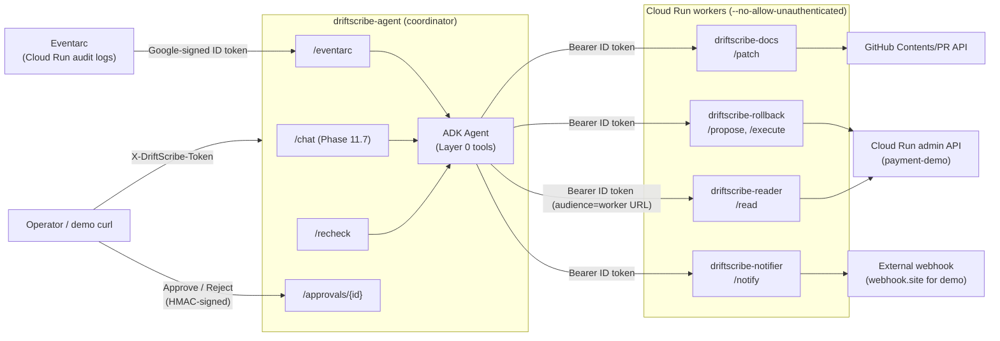

# DriftScribe multi-agent architecture

> **Status:** Phase 11.1 — coordinator-only deploy with operator token guard in place. Workers (Reader, Docs, Rollback, Notifier) are designed below; their implementations land in Phase 11.3–11.6. See `docs/plans/2026-05-19-driftscribe-v3-multi-agent.md` for the per-phase task list.

---

## 1. System topology

DriftScribe is decomposed into a coordinator and four execute-only worker services. Each runs as its own Cloud Run service with its own dedicated service account. The coordinator is the only public-facing entrypoint; workers refuse direct human traffic.

### Service inventory

| Service | Public? | Owns | Notes |
| --- | --- | --- | --- |
| `driftscribe-agent` (coordinator) | Yes — `--allow-unauthenticated` + `X-DriftScribe-Token` | ADK agent loop, intent classification, approval HTML/HMAC, Firestore session + approval state | Single entrypoint for humans, Eventarc, and demo scripts. |
| `driftscribe-reader` | No (`--no-allow-unauthenticated`) | Reading live Cloud Run env + revision of `payment-demo` | Hardcoded target — request body is rejected if it tries to override service/region/project. |
| `driftscribe-docs` | No | Patching runbook files under `demo/docs/`, opening PRs against a single repo | Path allowlist regex `^demo/docs/[^/]+\.md$`. Refuses `ops-contract.yaml`, `.github/`, `infra/`, anything `.py`. |
| `driftscribe-rollback` | No | Three endpoints: `/propose` → operator approval → `/execute` (HMAC-bound, single-use, 15-min TTL) on `payment-demo` only, OR `/deny` (Phase 11.9 — also HMAC-verified) | Approval UI lives on the **coordinator** so the gated page can be reached by a human. **Both decision paths** (approve and reject) verify the HMAC on this worker — the coordinator never validates the approval token itself, by design. |
| `driftscribe-notifier` | No | Posting normalized payload to a single env-injected webhook URL | Caller-supplied `url` is ignored — the worker's identity *is* the URL. |

---

## 2. Auth layers (two distinct boundaries)

DriftScribe has **two non-overlapping** auth mechanisms. Mixing them up has been the source of more than one self-inflicted outage in similar projects, so they are deliberately documented as separate concerns.

### Layer A — Operator → Coordinator: `X-DriftScribe-Token`

- **Where:** `agent/auth.py::verify_token` wired via `Depends(verify_token)` on `/recheck` (and on `/chat` in Phase 11.7).
- **Mechanism:** Shared random URL-safe token with 32 bytes of entropy (`python -c 'import secrets; print(secrets.token_urlsafe(32))'` → 43-character string; do NOT use `token_urlsafe(24)` which produces a 32-*character* string with less entropy), generated once by the operator and stored in Secret Manager (`coordinator-shared-token`). Cloud Run injects it via `--set-secrets=DRIFTSCRIBE_TOKEN=coordinator-shared-token:latest`. The same token is pasted into the operator's `curl` invocations.
- **Comparison:** `secrets.compare_digest(provided.encode(), expected.encode())` — never `==`. The unit test `tests/integration/test_token_guard.py::test_constant_time_compare_is_used` enforces this mechanically by patching `agent.auth.secrets.compare_digest` and asserting it was called.
- **Status codes:** 503 if `DRIFTSCRIBE_TOKEN` is unset (fail closed — see `agent/auth.py`), 401 if header missing, 403 if mismatch. The 403 response never echoes the supplied token back.
- **Scope:** Operator-facing endpoints only. `/healthz`, `/runs/{id}`, `/eventarc`, and `/approvals/*` are **not** guarded by this layer — they use Cloud Run health probes (open), best-effort public reads, Google-signed ID tokens from Eventarc, and per-approval HMAC tokens respectively.

### Layer B — Coordinator → Worker: audience-bound Google ID tokens

- **Where:** `agent/worker_client.py` (lands in Phase 11.7). Spike 11.0 proved the mechanism end-to-end; see `spikes/cloud_run_auth/README.md` for the verified gotchas (audience must be the worker's *root* URL, not a path; metadata server caches tokens for ~3500s).
- **Mechanism:** Coordinator mints an ID token via `google.oauth2.id_token.fetch_id_token(Request(), audience=<worker root URL>)` and sends it as `Authorization: Bearer <token>`. The worker calls `verify_oauth2_token` with the same audience and asserts the email claim is the coordinator's service-account email.
- **Why two checks (audience + caller allowlist):** Audience binding alone prevents token replay against the wrong service. Caller-email allowlist additionally prevents a different Cloud Run service in the same project from calling the worker with a valid-but-foreign token.
- **Scope:** Every coordinator → worker hop. Workers are deployed with `--no-allow-unauthenticated`, so an attacker without a coordinator-SA-minted token gets a 403 from Cloud Run before even reaching the worker process.

### Why both layers coexist

- Layer A keeps the **public surface** small: only the coordinator, and only via a token the operator controls.
- Layer B keeps the **internal surface** small: even if the coordinator is compromised, the worker still verifies that the caller is the coordinator's SA and that the token was minted for *this* worker's audience.

There is no path where Layer A's token alone unlocks worker access, nor where Layer B's ID token grants `/recheck`. The two were considered for collapsing into one shared secret during the v3 plan review; the conclusion (recorded in the plan's Codex review notes) was that Google's identity primitives for internal traffic are stronger than any shared-HMAC scheme we'd reinvent, while human-facing endpoints need a string we can paste into a curl. Hence: two layers.

---

## 3. Worker interfaces

Each worker has a tiny REST surface with a hardcoded "payload-intent policy" — the request body cannot select a different target than the worker's deploy-time configuration. The policy is what makes the worker safe to expose even if the coordinator misbehaves.

### Reader — `driftscribe-reader`

- **Endpoint:** `POST /read`
- **Request:** `{}` (empty object). Any extra fields → 400.
- **Response:** `{ "env": { "VAR": "value", ... }, "revision": "..." }`
- **Hardcoded policy:** `target_service=payment-demo`, `region=asia-northeast1`, `project=$PROJECT_ID` — all loaded from env at boot, all rejected if present in the request body.
- **Implementation:** Phase 11.3 (TODO).

### Docs — `driftscribe-docs`

- **Endpoint:** `POST /patch`
- **Request:** `{ "file": "demo/docs/runbook.md", "section": "...", "new_content": "...", "title": "...", "body": "..." }`
- **Response:** `{ "pr_url": "..." }` (or `{ "dry_run": true, "preview": "..." }`)
- **Hardcoded policy:** `repo=adi-prasetyo/driftscribe` (env). Path allowlist regex `^demo/docs/[^/]+\.md$`. Refuses `ops-contract.yaml`, `.github/`, `infra/`, `Dockerfile`, `*.py`. Path traversal (`..`) is normalized-then-checked.
- **Auth to GitHub:** Fine-grained PAT scoped to single repo, `Contents: Read & write`, `Pull requests: Read & write`. Stored as Secret Manager `docs-agent-github-pat`.
- **Implementation:** Phase 11.4 (TODO).

### Rollback — `driftscribe-rollback`

- **Endpoints:** `POST /propose`, `POST /execute`
- **Propose request:** `{ "target_revision": "...", "reason": "..." }` → returns `{ "approval_id": "...", "approval_url": "https://<coordinator>/approvals/<id>" }`
- **Execute request:** `{ "approval_id": "...", "approval_token": "<HMAC>" }`
- **Hardcoded policy:** `target_service=payment-demo` (env). Target revision must exist on the service AND not be the active revision. Approval token is HMAC'd with `approval-hmac-key`, single-use (Firestore transaction flips `pending → used`), 15-min TTL.
- **Approval UI:** Lives on the **coordinator** (`/approvals/{id}`). Rollback worker is private — it cannot host a public page.
- **Implementation:** Phase 11.5 (TODO).

### Notifier — `driftscribe-notifier`

- **Endpoint:** `POST /notify`
- **Request:** `{ "channel": "info|alert|approval", "severity": "...", "body": "..." }`
- **Response:** `{ "delivered": true }` (or error envelope)
- **Hardcoded policy:** Outbound URL = `$NOTIFY_WEBHOOK_URL` from Secret Manager. Caller-supplied `url` is silently dropped. Channel values are constrained to a closed enum.
- **Implementation:** Phase 11.6 (TODO).

---

## 4. Layer 0 — capability-bounded tool registry

The coordinator's ADK agent operates against an explicit, hardcoded list of tools — `agent.adk_agent.COORDINATOR_TOOLS`. The LLM cannot invoke anything outside this list; no `execute_shell`, no `arbitrary_http_request`, no direct GCP/GitHub SDK calls.

The 6 registered tools (as of Phase 11.7):

| Tool | Purpose | Routes to |
|---|---|---|
| `read_live_env_tool` | Read Cloud Run service env + revision | Reader Agent (`/read`) |
| `propose_rollback_tool` | Create an approval doc for a rollback | Rollback Agent (`/propose`) |
| `patch_docs_tool` | Open a docs PR | Docs Agent (`/patch`) |
| `notify_tool` | Post to webhook | Notifier Agent (`/notify`) |
| `search_recent_prs_tool` | Read-only PR history | Coordinator-internal (read-only GitHub token) |
| `load_contract_tool` | Read the baked-in ops contract | Coordinator-internal (filesystem) |

**Enforcement:** `tests/unit/test_coordinator_tool_inventory.py` (Phase 11.4b) pins this set. Adding or removing a tool requires updating the `EXPECTED_TOOL_NAMES` constant in that test. A second test asserts no tool name matches a dangerous-capability pattern (`shell|exec|subprocess|os_command|delete|drop|destroy|sudo|raw_http|arbitrary|run_command|eval`) so even an intentional addition can't slip an obviously-wrong name through. A third smoke test asserts that importing `agent.adk_agent` does not pull in remote-execution SDKs (`paramiko`, `fabric`, `pexpect`).

Cross-references:
- `agent.adk_agent.COORDINATOR_TOOLS` — the canonical list
- `agent.adk_tools` — the tool implementations
- The system prompts in `agent.adk_agent.SYSTEM_PROMPT_RECHECK` and `SYSTEM_PROMPT_CHAT` explicitly tell the LLM "you can ONLY call worker tools; you cannot mutate any system directly."

If you add a tool in a future PR:
1. Implement it in `agent/adk_tools.py`
2. Add it to `COORDINATOR_TOOLS` in `agent/adk_agent.py`
3. Update `EXPECTED_TOOL_NAMES` in `tests/unit/test_coordinator_tool_inventory.py`
4. Update this section of `multi-agent-design.md`
5. Justify the addition in the PR description against Layer 0's threat model (accidental damage from the LLM doing reasonable-looking-but-wrong things)

Layer 0 is the *first* safety net. Even if a prompt-injection attack convinces the agent to "rm -rf /", the agent simply does not have a tool that can. Layers 1 (per-SA IAM, see `iam-matrix.md`), 2 (worker payload-intent policies, see §3), and 3 (the deterministic validator that already existed in v1) sit underneath.

### Layer 1 caveats called out in Phase 11.9 (Codex 11.7 review)

The coordinator's Layer 1 claim is overstated in two narrow ways that
are documented as carry-overs into Phase 13 rather than closed in
Phase 11. Both are bounded by Layer 0's tool registry — the LLM cannot
exercise either path through normal control flow.

1. **The coordinator's `github-pat` MUST be a read-only fine-grained
   PAT.** The application code only ever calls GitHub's PR list/read
   APIs (via `search_recent_prs_tool`), but the IAM scope of the secret
   is whatever PAT the operator stored. If a classic PAT with `repo`
   scope is stored, the coordinator has GitHub write capability in
   practice, contradicting the iam-matrix.md negative-space claim. The
   Phase 11.9 deploy runbook (`docs/runbooks/deploy.md`) now requires
   a fine-grained PAT — operators who deployed earlier should rotate.

2. **`roles/run.viewer` on the coordinator is a temporary grant for
   the legacy classifier path.** When `USE_ADK=false` the coordinator
   calls `read_live_env` directly to feed the deterministic classifier.
   Phase 13 will route the classifier through the Reader Worker (same
   shape as Phase 11.7 did for the ADK path); at that point the
   project-level `run.viewer` grant can be removed.

See `docs/architecture/iam-matrix.md` §"Phase 11.9 carry-overs" for
the full statement, and Phase 13's "Carry-over from Phase 11 Codex
review" in `docs/plans/2026-05-19-driftscribe-v3-multi-agent.md` for
the planned closure.

---

## 5. HITL (human-in-the-loop) approval flow

> **Status:** Implementation lands in Phase 13. Sketched here so the security model is reviewable in one place.

1. Coordinator's ADK agent decides a rollback is warranted and calls `delegate_to_rollback(target_revision, reason)`.
2. Rollback worker writes `approvals/{id}` to Firestore with `status=pending`, mints an HMAC-signed token, returns `{ approval_url, approval_token }`. The token is `HMAC(approval-hmac-key, approval_id || target_revision || expires_at)`.
3. Coordinator sends the approval URL to the operator via the Notifier (or surfaces it in the `/chat` response).
4. Operator opens `https://<coordinator>/approvals/<id>`, sees the rollback plan rendered server-side. Page has no external assets, `Cache-Control: no-store`, `Referrer-Policy: no-referrer`.
5. Operator clicks **Approve** — browser POSTs to `/approvals/<id>` with the HMAC token in the body (not URL — avoids referrer/log leaks).
6. Coordinator verifies the HMAC + TTL, flips Firestore `pending → approved` in a transaction, then calls Rollback worker's `/execute` with the *stored canonical request* (not browser-supplied data — defends against approval-page tampering).
7. Rollback worker re-verifies the HMAC token against its stored copy in another transaction (`approved → used`), then calls Cloud Run admin to flip traffic. Replay returns 403.

The double transaction (coordinator and worker each flip state once) is the canonical fix for the "operator clicks twice / browser auto-retries" failure mode.

---

## 6. Cross-references

- Implementation plan: `docs/plans/2026-05-19-driftscribe-v3-multi-agent.md`
- IAM matrix (per-SA grants + negative space): [`iam-matrix.md`](./iam-matrix.md)
- Cloud Run inter-service auth proof: `spikes/cloud_run_auth/README.md`
- Token guard implementation: `agent/auth.py`, `tests/integration/test_token_guard.py`
